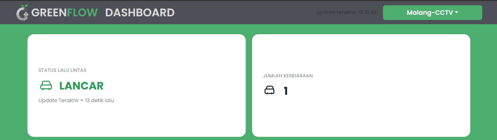
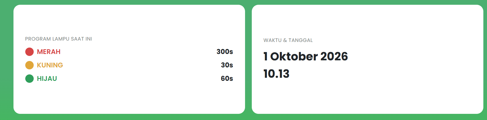
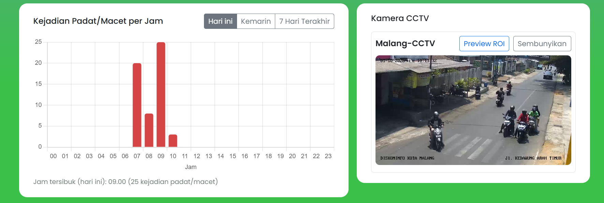
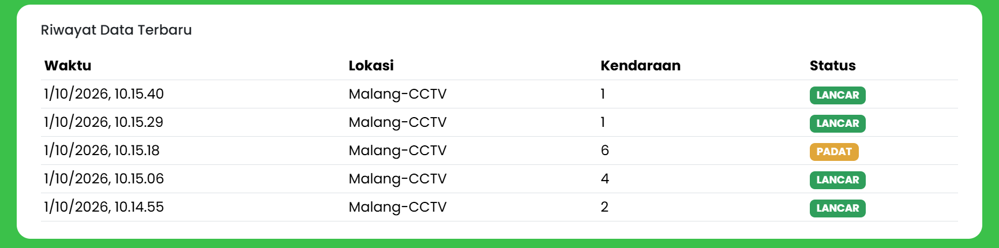
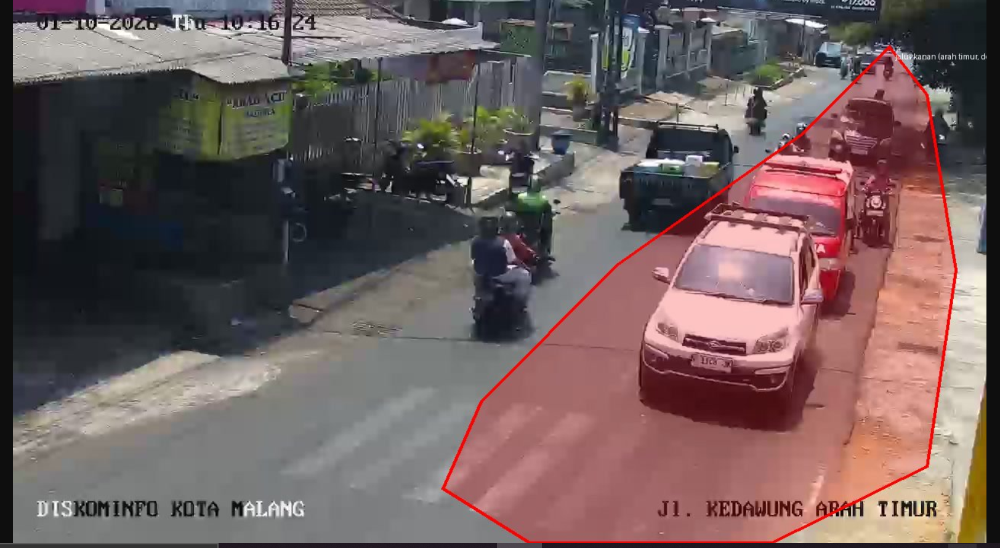
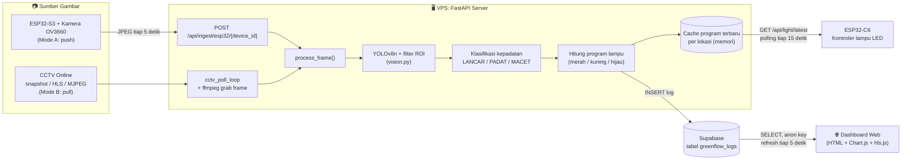

<div align="center">

# 🚦 GreenFlow

**Sistem lampu lalu lintas adaptif berbasis computer vision (YOLOv8) dengan dashboard pemantauan real-time.**


</div>

---

## 📖 Tentang Proyek

Lampu lalu lintas konvensional memakai durasi tetap, sehingga lajur yang sedang padat tetap harus menunggu lama saat lampu merah, sementara lajur yang sepi tetap mendapat durasi hijau yang sama.

**GreenFlow** mengatasi hal ini dengan cara:

1. **Melihat** kondisi jalan lewat kamera (kamera ESP32-S3 atau CCTV online yang sudah ada).
2. **Menghitung** jumlah kendaraan dengan model **YOLOv8n**, bisa dibatasi pada satu lajur saja memakai *Region of Interest* (ROI).
3. **Menentukan** status lalu lintas: `LANCAR`, `PADAT`, atau `MACET`.
4. **Menyesuaikan** program lampu (durasi merah, kuning, hijau) secara otomatis.
5. **Menampilkan** semuanya di dashboard web secara real-time.

---

## ✨ Fitur Utama

- 🎥 **Dua sumber video**: kamera ESP32-S3 (push) atau CCTV online berbasis snapshot, HLS, atau MJPEG (pull).
- 🚗 **Deteksi kendaraan** mobil, motor, bus, dan truk dengan YOLOv8n, dengan parameter yang disetel untuk lalu lintas motor Indonesia yang rapat.
- 🛣️ **Filter lajur (ROI)**: hanya kendaraan di lajur yang relevan yang dihitung.
- 🧠 **Program lampu adaptif** dengan dua kondisi tetap: baseline dan padat.
- 🔌 **Kontroler lampu ESP32-C6** yang tetap berjalan meski WiFi/server terputus.
- 📊 **Dashboard web**: status, jumlah kendaraan, program lampu, grafik kepadatan per jam, tayangan CCTV, dan riwayat data.
- 🗄️ **Penyimpanan di Supabase** (PostgreSQL) dengan Row Level Security.

---

## 🖼️ Tampilan Dashboard

### Status lalu lintas dan jumlah kendaraan
Menampilkan status terkini (`LANCAR` / `PADAT` / `MACET`), jumlah kendaraan yang terdeteksi, dan selector lokasi.



### Program lampu dan waktu
Durasi merah, kuning, dan hijau yang sedang berlaku, beserta waktu dan tanggal.



### Grafik kepadatan dan kamera CCTV
Grafik jumlah kejadian padat/macet per jam (**Hari ini**, **Kemarin**, **7 Hari Terakhir**) dan tayangan langsung kamera CCTV.



### Riwayat data terbaru
Tabel pencatatan terbaru: waktu, lokasi, jumlah kendaraan, dan status.



### Preview ROI (filter lajur)
Tombol **Preview ROI** menampilkan area lajur yang dihitung (poligon merah). Kendaraan di luar area ini tidak ikut dihitung.



---

## 🏗️ Arsitektur Sistem



---

## 🔄 Alur Kerja Sistem

### 1. Pengambilan gambar

Ada dua cara gambar masuk ke server, keduanya berakhir di fungsi `process_frame()` yang sama:

| Mode | Cara kerja | Cocok untuk |
|------|-----------|-------------|
| **A: ESP32-S3 (push)** | ESP32-S3 memotret tiap **5 detik** lalu mengirim JPEG ke `POST /api/ingest/esp32/{device_id}?location=...` | Persimpangan yang dipasangi kamera sendiri |
| **B: CCTV online (pull)** | Server mengambil frame dari URL CCTV tiap `cctv_poll_interval_seconds` (default **10 detik**). Untuk stream HLS/MJPEG, 1 frame diambil dengan **ffmpeg** | Lokasi yang sudah punya CCTV publik (mis. Diskominfo) |

### 2. Deteksi kendaraan (`vision.py`)

- Frame dianalisis oleh **YOLOv8n** untuk mendeteksi 4 kelas kendaraan: `car`, `motorcycle`, `bus`, `truck`.
- Parameter disetel untuk lalu lintas motor yang rapat:
  - `conf = 0.25` (lebih rendah dari default 0.35) agar motor yang tertutup sebagian tetap terdeteksi.
  - `iou = 0.85` (lebih tinggi dari default 0.7) agar dua motor yang berdampingan tidak digabung menjadi satu.

### 3. Filter lajur (ROI)

Satu frame CCTV sering mencakup beberapa lajur atau arah, padahal lampu hanya mengatur satu lajur.

- ROI didefinisikan sebagai **poligon** berkoordinat ternormalisasi (0.0 sampai 1.0), sehingga tidak bergantung pada resolusi kamera.
- Sebuah kendaraan dihitung **hanya jika titik tengah bounding box-nya berada di dalam poligon** (algoritma *ray-casting*).
- Jumlah seluruh lajur tetap disimpan sebagai pembanding di kolom `counts_by_class`.
- Poligon dapat dikalibrasi lewat `GET /api/debug/roi-preview?location=...`.

### 4. Klasifikasi kepadatan

Jumlah kendaraan dibandingkan dengan ambang batas per lokasi (`density_low` dan `density_high` di `config.yaml`):

| Jumlah kendaraan | Status |
|------------------|--------|
| `< density_low` | 🟢 **LANCAR** |
| `density_low` sampai `< density_high` | 🟡 **PADAT** |
| `>= density_high` | 🔴 **MACET** |

Contoh untuk lokasi `Malang-CCTV`: `density_low = 6`, `density_high = 18`.

### 5. Penentuan program lampu

Program lampu hanya memiliki **dua kondisi tetap** (bukan interpolasi):

| Kondisi | Merah | Kuning | Hijau |
|---------|:-----:|:------:|:-----:|
| **LANCAR** (baseline) | 300 dtk (05:00) | 30 dtk (00:30) | 60 dtk (01:00) |
| **PADAT / MACET** | 120 dtk (02:00) | 60 dtk (01:00) | 180 dtk (03:00) |

Begitu kondisi kembali `LANCAR`, program otomatis kembali ke baseline.

### 6. Penyimpanan dan distribusi data

Setelah program dihitung, server melakukan dua hal:

1. **Menulis log** ke tabel `greenflow_logs` di Supabase (dipakai dashboard).
2. **Menyimpan program terbaru di memori** per lokasi, sehingga endpoint untuk ESP32-C6 langsung merespons tanpa menyentuh database.

### 7. Kontrol lampu (ESP32-C6)

- ESP32-C6 melakukan polling `GET /api/light/latest?location=...` tiap **15 detik**.
- Program baru **tidak langsung diterapkan**, melainkan di awal siklus berikutnya, sehingga fase hijau tidak pernah terpotong di tengah jalan.
- Siklus yang dijalankan: **MERAH → HIJAU → KUNING → MERAH**.
- Jika server tidak terjangkau, lampu tetap berjalan memakai program terakhir yang berhasil diambil (atau program bawaan firmware jika belum pernah terhubung).

### 8. Dashboard

Dashboard membaca langsung dari Supabase memakai **anon key** (hanya bisa `SELECT` berkat RLS) dan menyegarkan data tiap **5 detik**. Tayangan CCTV memakai **hls.js** untuk stream `.m3u8`. Daftar kamera diambil dari `GET /api/cameras`.

---

## 📁 Struktur Folder

```
greenflow/
├── server/                         # Backend FastAPI (VPS)
│   ├── app.py                      # Endpoint API, ingest, polling CCTV
│   ├── vision.py                   # YOLOv8 + ROI + klasifikasi + program lampu
│   ├── config.example.yaml         # Contoh konfigurasi (salin ke config.yaml)
│   ├── greenflow.service           # Unit systemd
│   └── requirements.txt
├── supabase/
│   └── schema.sql                  # Skema tabel + RLS
├── web/                            # Dashboard (static site)
│   ├── dashboard.html
│   ├── colorpalette.css
│   ├── config.js                   # URL + anon key Supabase
│   └── pictures/
└── firmware/
    ├── esp32s3_camera/             # Node kamera (Mode A)
    └── esp32c6_trafficlight/       # Kontroler lampu LED
```

---

## 🧰 Teknologi dan Perangkat Keras

**Perangkat lunak**

| Bagian | Teknologi |
|--------|-----------|
| Backend | Python, FastAPI, Uvicorn |
| Computer vision | Ultralytics YOLOv8n, NumPy, Pillow |
| Pengambilan stream | ffmpeg, requests |
| Database | Supabase (PostgreSQL) |
| Frontend | HTML, Bootstrap, Chart.js, hls.js, supabase-js |
| Firmware | Arduino (ESP32), ArduinoJson |

**Perangkat keras**

- ESP32-S3 + kamera OV3660 (opsional, untuk Mode A)
- ESP32-C6-VROOM-1 + modul LED lampu lalu lintas 5V (3 kanal)
- VPS Linux (disarankan Ubuntu/Debian)

---

## 🚀 Instalasi

### 1. Siapkan Supabase

1. Buat project baru di [Supabase](https://supabase.com).
2. Buka **SQL Editor → New query**, tempel isi `supabase/schema.sql`, lalu **Run**.
3. Catat **Project URL**, **anon key**, dan **service_role key** dari *Project Settings → API*.

> ⚠️ `service_role key` hanya untuk server. **Jangan pernah** menaruhnya di `web/config.js` atau di repository publik.

### 2. Jalankan server (VPS)

```bash
# Dependensi sistem
sudo apt update && sudo apt install -y python3-venv ffmpeg

# Ambil kode
git clone https://github.com/gathanega/greenflow-project.git
cd greenflow-project/greenflow-project/greenflow/server

# Virtual environment + dependensi Python
python3 -m venv venv
source venv/bin/activate
pip install -r requirements.txt

# Konfigurasi
cp config.example.yaml config.yaml
nano config.yaml        # isi URL dan service_key Supabase, serta daftar lokasi

# Jalankan
uvicorn app:app --host 0.0.0.0 --port 8000
```

> Model `yolov8n.pt` diunduh otomatis saat pertama kali dijalankan (butuh internet sekali).

**Menjalankan sebagai service (systemd)**

```bash
sudo cp greenflow.service /etc/systemd/system/
sudo systemctl daemon-reload
sudo systemctl enable --now greenflow
```

Sesuaikan `User`, `WorkingDirectory`, dan path `venv` di `greenflow.service` dengan lokasi instalasi Anda (default: `/opt/greenflow/server`).

### 3. Konfigurasi lokasi (`config.yaml`)

```yaml
supabase:
  url: "https://PROJECT_REF.supabase.co"
  service_key: "SERVICE_ROLE_KEY"

cctv_poll_interval_seconds: 10

locations:
  "Malang-CCTV":
    mode: cctv                    # cctv = tarik dari CCTV online, esp32 = terima kiriman ESP32-S3
    cctv_snapshot_url: "https://..."
    cctv_stream_type: hls         # snapshot | hls | mjpeg
    device_id: "cctv-malang"
    density_low: 6                # di bawah ini = LANCAR
    density_high: 18              # di atas/sama dengan ini = MACET
    roi_label: "jalur kanan (arah timur, dekat kamera)"
    roi:                          # poligon lajur, koordinat 0.0 - 1.0
      - [0.90, 0.09]
      - [0.81, 0.25]
      # ... titik lainnya
```

Nama lokasi harus **sama persis** dengan `LOCATION_NAME` di firmware ESP32-C6 dan parameter `?location=` di firmware ESP32-S3.

### 4. Kalibrasi ROI

Buka di browser untuk melihat poligon di atas frame CCTV langsung:

```
http://<server>/api/debug/roi-preview?location=Malang-CCTV
```

Ubah titik-titik `roi` di `config.yaml` sampai area merah menutupi lajur yang ingin dihitung, lalu restart server.

### 5. Pasang dashboard

1. Isi `SUPABASE_URL` dan `SUPABASE_ANON_KEY` di `web/config.js`.
2. Sajikan folder `web/` sebagai situs statis (Nginx, Apache, atau lainnya).
3. Dashboard memanggil `/api/cameras` secara relatif, jadi sajikan **web dan API dari domain yang sama** (mis. reverse proxy `/api/` ke `localhost:8000`).

### 6. Flash firmware

**ESP32-C6 (kontroler lampu)**: buka `firmware/esp32c6_trafficlight/esp32c6_trafficlight.ino`

- Board: `ESP32C6 Dev Module` (paket *esp32* by Espressif ≥ 3.0.0)
- Library: `ArduinoJson`
- Isi `WIFI_SSID`, `WIFI_PASSWORD`, `SERVER_HOST`, `LOCATION_NAME`
- Pin: `RED → GPIO 4`, `YELLOW → GPIO 5`, `GREEN → GPIO 6`, GND bersama, modul LED ditenagai **5V eksternal**

**ESP32-S3 (kamera, opsional)**: buka `firmware/esp32s3_camera/esp32s3_camera.ino`

- Isi WiFi, `SERVER_HOST`, `DEVICE_ID`, `LOCATION_NAME`
- Periksa kembali pin kamera sesuai breakout board Anda

---

## 🔌 Endpoint API

| Method | Endpoint | Fungsi |
|--------|----------|--------|
| `POST` | `/api/ingest/esp32/{device_id}?location=...` | Menerima JPEG dari ESP32-S3 (body: raw JPEG) |
| `GET` | `/api/light/latest?location=...` | Program lampu terbaru untuk ESP32-C6 |
| `GET` | `/api/cameras` | Daftar kamera CCTV untuk dashboard |
| `GET` | `/api/debug/roi-preview?location=...` | Gambar frame + poligon ROI (kalibrasi) |
| `GET` | `/api/health` | Cek status server dan lokasi yang dipantau |

Contoh respons `/api/light/latest`:

```json
{
  "red_seconds": 120,
  "yellow_seconds": 60,
  "green_seconds": 180,
  "traffic_status": "PADAT",
  "vehicle_count": 8,
  "updated_at": 1790824715.5
}
```

---

## 🗄️ Skema Database

Tabel `greenflow_logs`:

| Kolom | Tipe | Keterangan |
|-------|------|-----------|
| `id` | bigint | Primary key |
| `created_at` | timestamptz | Waktu pencatatan |
| `device_id` | text | ID perangkat/kamera |
| `location` | text | Nama lokasi |
| `vehicle_count` | integer | Jumlah kendaraan (di dalam ROI bila ada) |
| `counts_by_class` | jsonb | Rincian per kelas kendaraan (+ perbandingan seluruh lajur bila ROI aktif) |
| `light_status` | text | Fase lampu saat pencatatan |
| `green_duration` | integer | Durasi hijau (detik) |
| `battery_level` | integer | Level baterai (%) |
| `traffic_status` | text | `LANCAR` / `PADAT` / `MACET` |

**Keamanan:** RLS aktif. Dashboard (anon key) hanya boleh `SELECT`; penulisan hanya dari server memakai `service_role key`.

---

## 👥 Kontributor

- [**Gathan Ega Fyandhika**](https://github.com/gathanega)
- [**titanioleonard17-u**](https://github.com/titanioleonard17-u)

---

<div align="center">

Dibuat untuk lalu lintas yang lebih lancar dan ramah lingkungan 🌱

</div>
